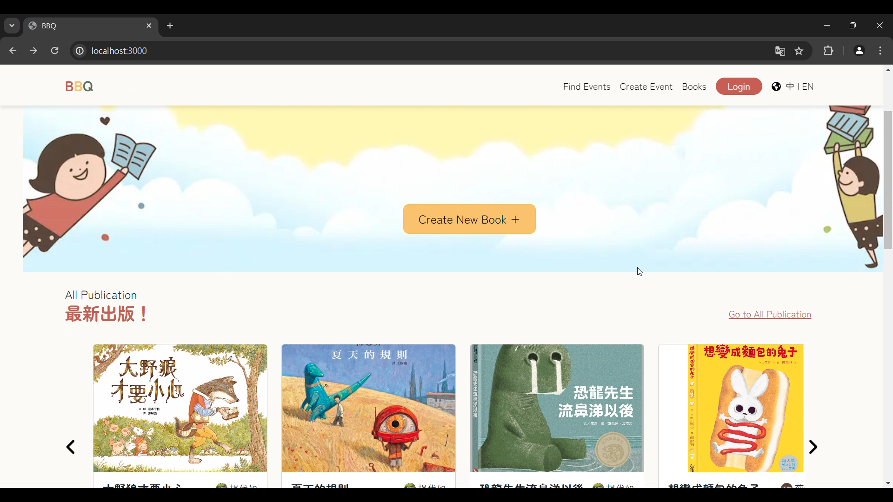
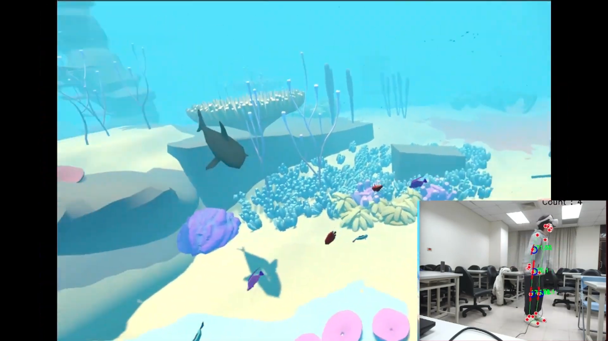
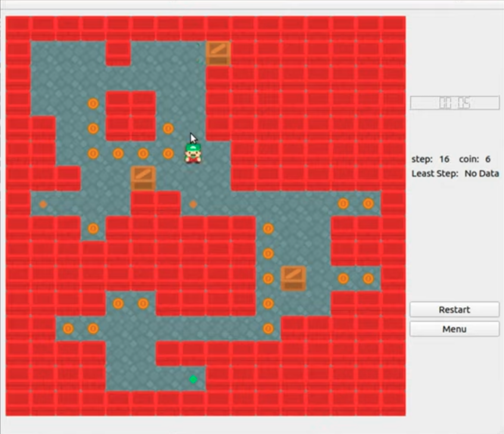
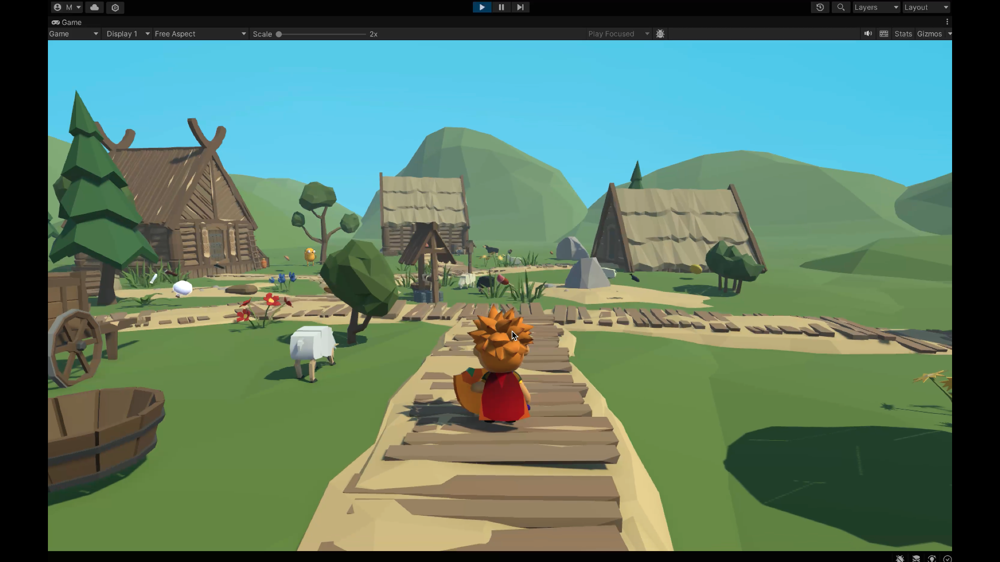

# 蔡孟璇 專案作品相關連結

## 1. 大型合作專案 - 繪本網站

**使用語言及工具：** JavaScript、React

**成果：** [Demo 影片](https://drive.google.com/file/d/1tChAO_m7C5pXPKEVv7ClCa33wWdMSPM5/view?usp=drive_link)

---

## 2. 大型合作專案 - VR遊戲製作

**使用語言及工具：** C#、Unity

**成果：** [Demo 影片](https://drive.google.com/file/d/1VTs568QTPwslCHxxMSRKna82YltraG62/view?usp=drive_link)

---

## 3. 個人程式作品 - 遊戲設計——推箱子

**使用語言：** C++、Qt

**成果：** [遊戲功能展示影片](https://www.youtube.com/watch?v=GkovijjWddk)

**簡介：**
引用 Qt 的 class，包括 menu 頁面按鈕的配置、匯入地圖的佈局以及滑鼠、鍵盤事件。遊戲方式為移動角色將所有箱子推向儲存點即為勝利，並額外增加一些互動，如：撿金幣、採炸彈等，讓遊戲增加豐富度。

---

## 4. 個人程式作品 - 人物操作遊戲練習

**使用語言及工具：** C#、Unity

**成果：** [遊戲功能展示影片](https://www.youtube.com/watch?v=yzHzVgvB6Ws)

